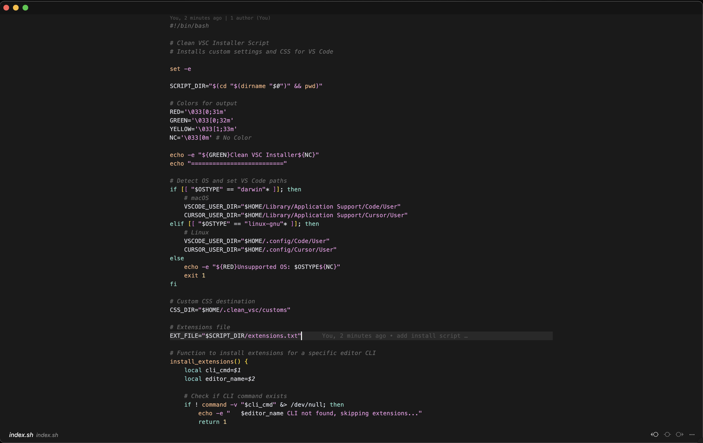
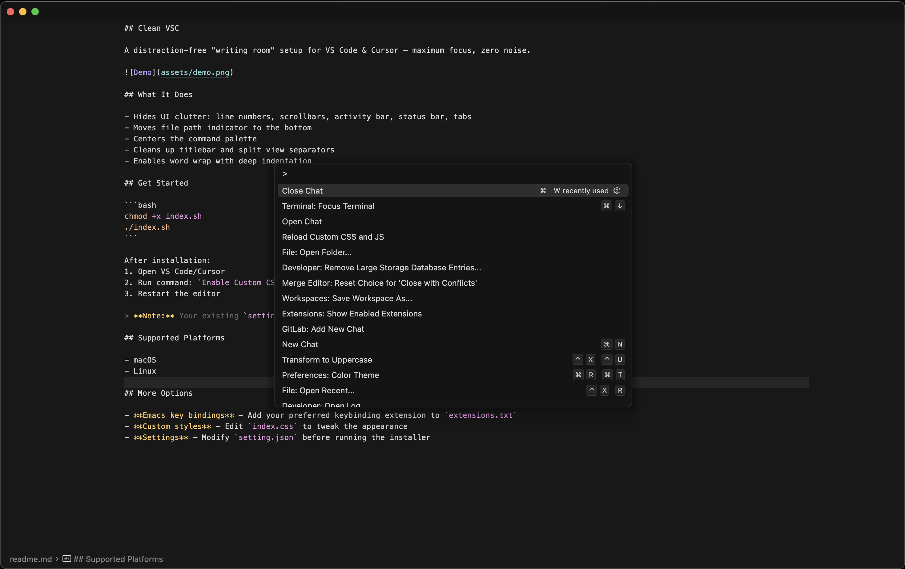

## Clean VSC

A distraction-free "writing room" setup for VS Code & Cursor — maximum focus, zero noise.





## What It Does

- Hides UI clutter: line numbers, scrollbars, activity bar, status bar, tabs
- Moves file path indicator to the bottom
- Centers the command palette
- Cleans up titlebar and split view separators
- Enables word wrap with deep indentation

## Get Started

```bash
curl -fsSL https://raw.githubusercontent.com/raftio/clean-vsc/main/install.sh | bash
```

After installation:
1. Open VS Code/Cursor
2. Run command: `Enable Custom CSS and JS`
3. Restart the editor

> **Note:** Your existing `settings.json` is automatically backed up and merged (not replaced).

## Supported Platforms

- macOS
- Linux

## More Options

- **Emacs key bindings** — Add your preferred keybinding extension to `extensions.txt`
- **Custom styles** — Edit `index.css` to tweak the appearance
- **Settings** — Modify `setting.json` before running the installer
